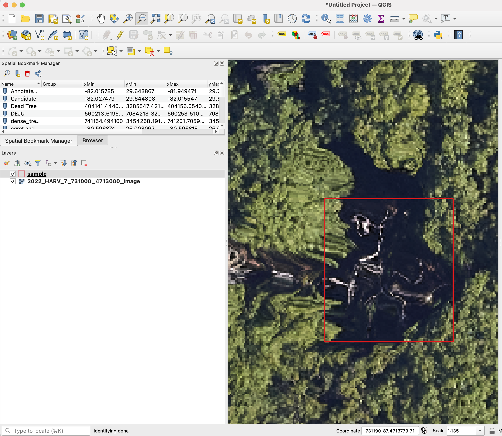
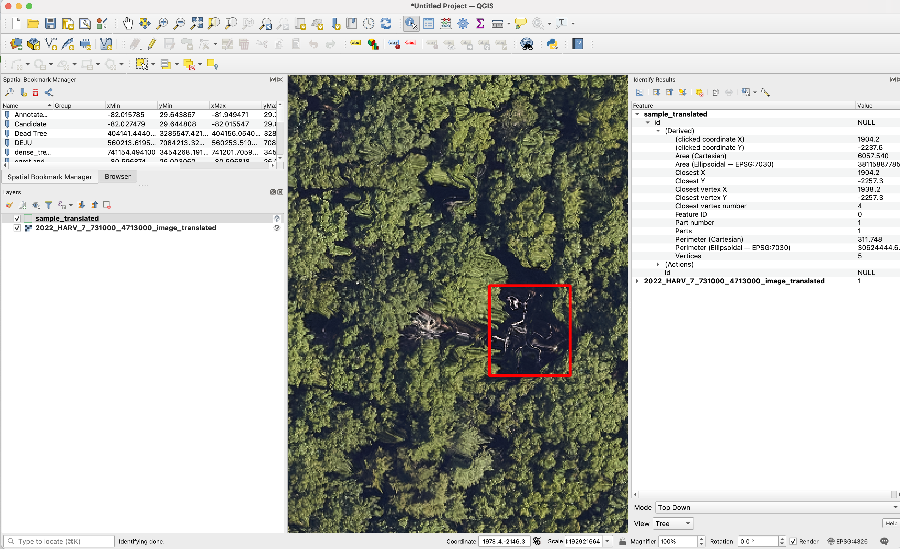
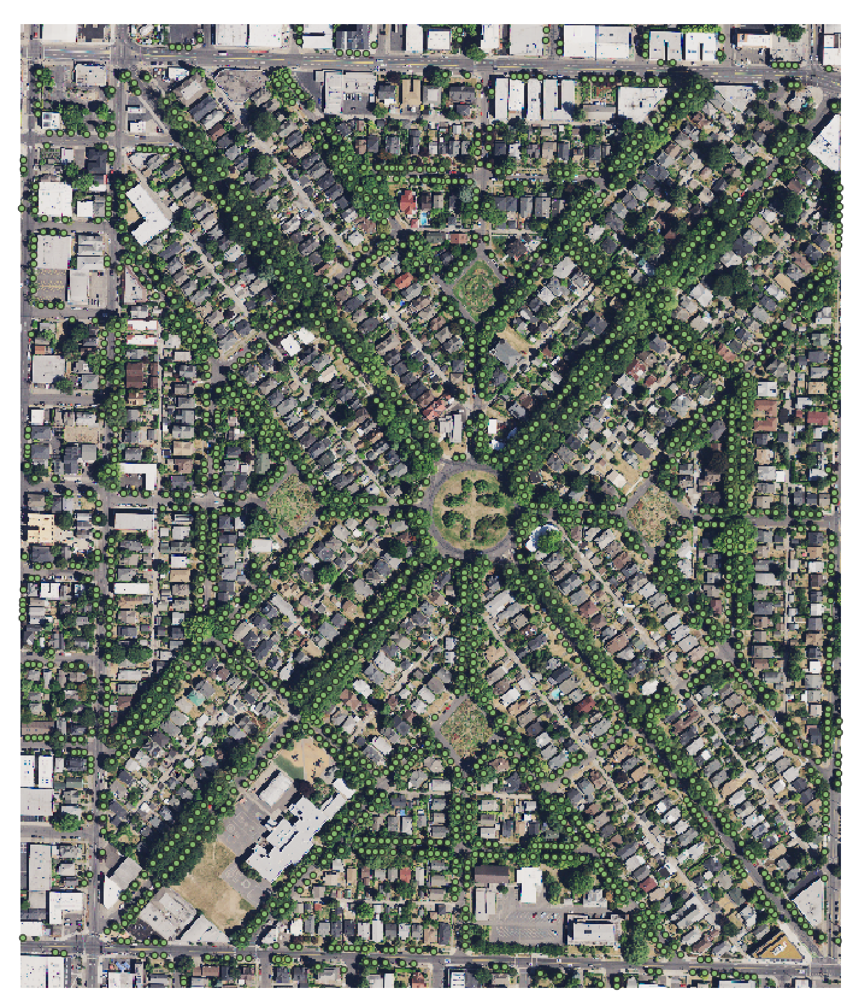
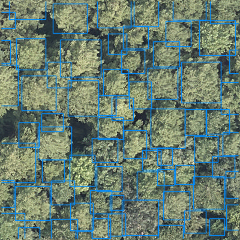

# Contributing

## Data

The essential data are

1. **Airborne imagery**

    Drone or piloted aircraft preferred, we are not yet convinced about tree segmentation from satellite sources, but open to discussion. Preferably in .tif format with georeferencing.

2. **Tree annotations**

    Point, box, or polygon annotations of trees in the imagery. In shapefile format with matching georeferencing as the airborne imagery.

The spatial location of the points will be destroyed, such that the point locations will only be relative to the image crop. This will prevent any user from being able to use the data for analysis outside of the benchmark. All species, DBH and other metadata will be removed. For the images, if the geospatial location is the problem, as is it with many datasets, let the provider know that we are destroying the geospatial position, such that we crop images into pieces and remove the coordinate reference system and make any tree annotations relative to the 0,0 image origin, this way we are not releasing any geolocated data that might have privacy issues.

For open source data in which authors don't have concerns about privacy, the best way to contribute is to make data available on [Zenodo](https://zenodo.org/), and then make an issue in this repo documenting the location of the data. Your Zenodo record will now have a DOI that is citable. We are sensitive to the contributions and efforts of the hundreds of field researchers that make data collection possible. Authorship will be extended to any team with unpublished data.

## Removing spatial data projection

We are always happy to help assist in data curation. No actions are needed before sharing data. All data will be treated confidentially and shared according to the bullets above. However, if you prefer to remove the spatial projection before sharing the data, [here is a sample code to convert projected data into unprojected data](https://github.com/weecology/MillionTrees/blob/main/data_prep/destroy_geo.py).




## What does a successful dataset look like?

We welcome any geometric representation of trees in airborne imagery. Points, polygons, or boxes. Usually we ask for a shapefile or text coordinates of trees and a corresponding .tif geospatial file of airborne imagery. When you overlay the two, the data should look coherent. There has been a narrow view of the task that has been overly constrained by off-the-shelf architectures, rather than the essential nature of the task. Tree localization, counting, and crown detection are all interrelated tasks using geometric representations of trees. We should not design benchmarks around current model architectures, we should put the problem first and build architectures that meet that need.





## How will the data be shared?

After we work with an author to find a suitable data sharing agreement, we will remove the spatial information from the images and create a Zenodo record to document a train/test split for the benchmark. A manuscript, which all contributors are invited to join, will be published outlining the strengths, limitations, and potential uses of the dataset. The working document describing technical details of evaluation is still in its infancy is [here](https://docs.google.com/document/d/1K6G1tcdTuAv3FgGiDWq5QhO-kSoBrxzTiic5jH1CZF4/edit?usp=sharing).

## Worked Example: Adding a New Dataset

To contribute a new dataset, you need to process the data into the required format, generate an `annotations.csv` file, and include it in the `package_datasets.py` script. Below is a step-by-step guide using the Harz Mountains dataset as an example.

### Step 1: Process the Dataset

The Harz Mountains dataset consists of shapefiles with tree annotations and corresponding `.tif` images. The goal is to process these files into a single `annotations.csv` file that can be used by the MillionTrees framework.

Here is the processing logic:

1. **Load Shapefiles**:
   - Use `geopandas` to read the shapefiles containing tree annotations.
   - Filter out invalid geometries (e.g., `MultiPolygons`).

2. **Convert Z Polygons to 2D**:
   - If the polygons have a Z-dimension (x, y, z), convert them to 2D (x, y) using `shapely`.

3. **Update Image Paths**:
   - Match each shapefile to its corresponding `.tif` image.
   - Convert the `.tif` images to `.png` format for compatibility and update the `image_path` field.

4. **Generate Annotations**:
   - Use the `deepforest.utilities.read_file` function to convert the processed data into the required format.
   - Add additional fields such as `label` (e.g., "tree") and `source` (e.g., "Harz Mountains").

5. **Save the Annotations**:
   - Combine all processed data into a single `annotations.csv` file.

### Example Code for Harz Mountains Data

The following code processes the Harz Mountains dataset:

```python
import geopandas as gpd
import pandas as pd
import glob
import os
from shapely.geometry import Polygon
from deepforest.utilities import read_file
from PIL import Image

# Load all train and test shapefiles
shapefiles = glob.glob("/orange/ewhite/DeepForest/Harz_Mountains/ML_TreeDetection_Harz/test/annotations/*.shp") + \
             glob.glob("/orange/ewhite/DeepForest/Harz_Mountains/ML_TreeDetection_Harz/train/annotations/*.shp")

annotations = []
for shapefile in shapefiles:
    print(f"Processing: {shapefile}")
    try:
        gdf = gpd.read_file(shapefile)
        # Remove MultiPolygons
        gdf = gdf[gdf.geometry.type == "Polygon"]

        # Convert Z polygons to 2D
        gdf = gdf.set_geometry(gdf.geometry.apply(
            lambda geom: Polygon([(x, y) for x, y, z in geom.exterior.coords]) if geom.has_z else geom
        ))

        # Update image paths
        gdf["image_path"] = os.path.basename(shapefile).replace(".shp", ".tif")
        gdf["image_path"] = gdf["image_path"].apply(lambda x: "aerial_" + x)

        # Convert .tif to .png
        for idx, row in gdf.iterrows():
            tif_path = os.path.join("/orange/ewhite/DeepForest/Harz_Mountains/ML_TreeDetection_Harz/all_images", row["image_path"])
            png_path = tif_path.replace(".tif", ".png")
            try:
                with Image.open(tif_path) as img:
                    img = img.convert("RGB")
                    img.save(png_path, "PNG")
                gdf.at[idx, "image_path"] = os.path.basename(png_path)
            except Exception as e:
                print(f"Could not convert {tif_path} to PNG: {e}")
                continue

        gdf["label"] = "tree"
        annotation = read_file(gdf, root_dir="/orange/ewhite/DeepForest/Harz_Mountains/ML_TreeDetection_Harz/all_images")
        annotations.append(annotation)

    except Exception as e:
        print(f"Could not process {shapefile}: {e}")
        continue

# Combine all annotations
annotations = pd.concat(annotations)

# Update full image paths
annotations["image_path"] = annotations["image_path"].apply(
    lambda x: os.path.join("/orange/ewhite/DeepForest/Harz_Mountains/ML_TreeDetection_Harz/all_images", x)
)

# Set the source
annotations["source"] = "Harz Mountains"

# Save combined annotations
output_csv = "/orange/ewhite/DeepForest/Harz_Mountains/ML_TreeDetection_Harz/annotations.csv"
annotations.to_csv(output_csv, index=False)
print(f"Annotations saved to {output_csv}")
```

## Packaging Logic

The `package_datasets.py` script is responsible for preparing datasets for release. It performs the following steps:

1. **Combining Datasets**:
   - Reads multiple `annotations.csv` files for different dataset types (e.g., `TreeBoxes`, `TreePoints`, `TreePolygons`).
   - Combines them into a single DataFrame for each type.

2. **Splitting Data**:
   - Randomly splits the data into training and testing sets (80/20 split by default).
   - Ensures that images are not duplicated across splits.

3. **Geometry Processing**:
   - Converts geometries (e.g., polygons, points, boxes) into formats required for training (e.g., bounding box coordinates, centroids).

4. **Validation**:
   - Ensures that geometry bounds are within expected ranges (e.g., no geographic coordinates).

5. **Packaging**:
   - Creates directories for each dataset type and version.
   - Copies images and annotations into these directories.
   - Saves the final datasets as CSV files.

6. **Mini Datasets**:
   - Creates smaller versions of the datasets for testing purposes.
   - Selects one image per source to create a representative sample.

7. **Zipping**:
   - Compresses the datasets into `.zip` files for easy distribution.

To add a new dataset, create a processing script in `data_prep`, generate an `annotations.csv` file, and include it in the appropriate list in `package_datasets.py`. Submit a pull request with your changes.